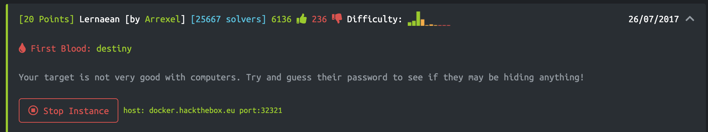
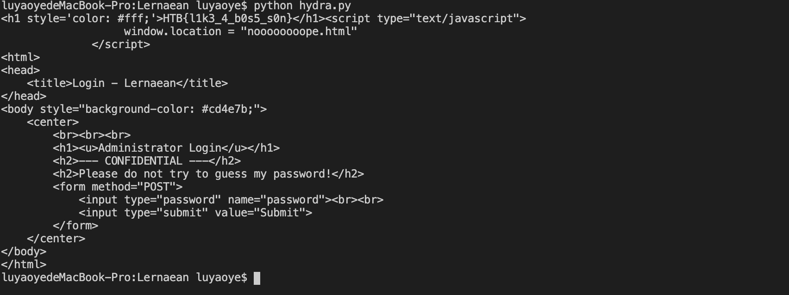
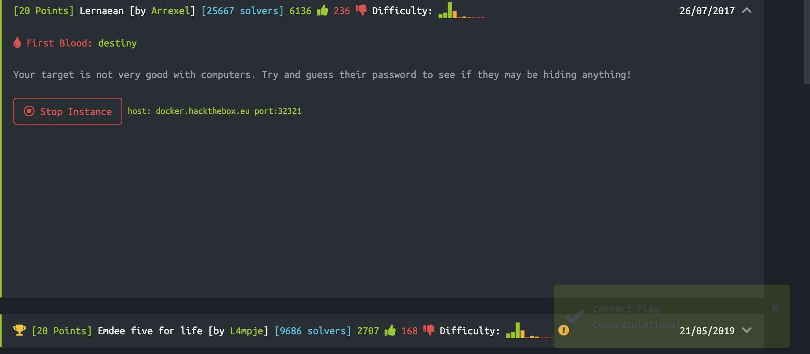

# Before Start

Launch instance

Go to the target website

# Trials

This question is quite confusing me, because there is no any clue.

So I try to do some reaserch on ways to crack a passowrd and find out there is a command called Hydra in Kali Linux.

So I look into that and was able to run the command as below:
`hydra -l admin -P <path> <target IP> http-post-form “/:password=^PASS^:Invalid password!” -s 38249`

Then I used some online IP tracker to found out the IP address of `docker.hackthebox.eu` is `139.59.202.58`.

So I ran the hydra command and got the password: `leonardo`.

I submit this password and the website give me a `too slow` message again.

Based on previous experience, I decide to write a script to make a POST request to the IP address. [Click here](./hydra.py) to see the script.

# Result

I successfully got the flag in the http response.

I submit the flag.

