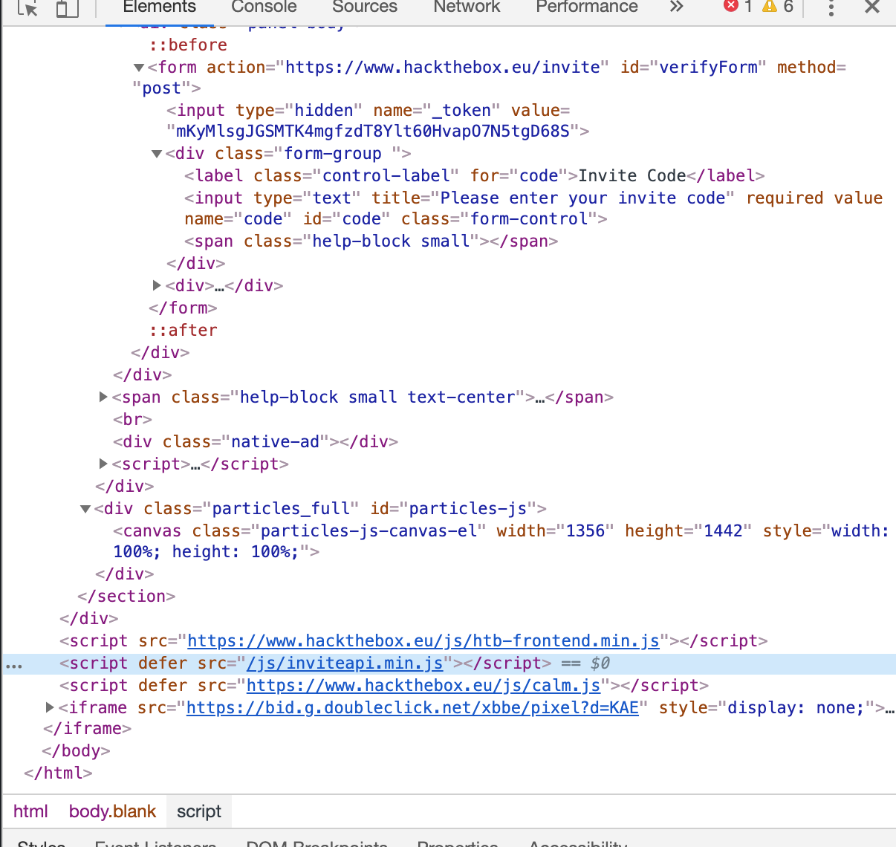
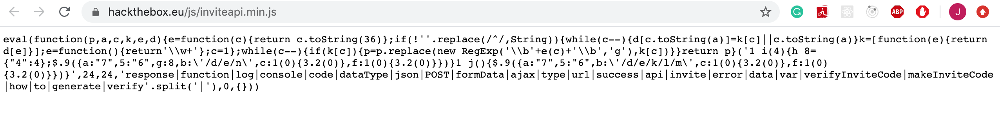
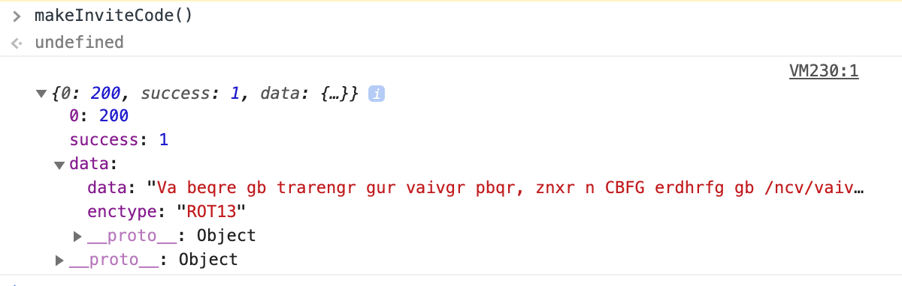
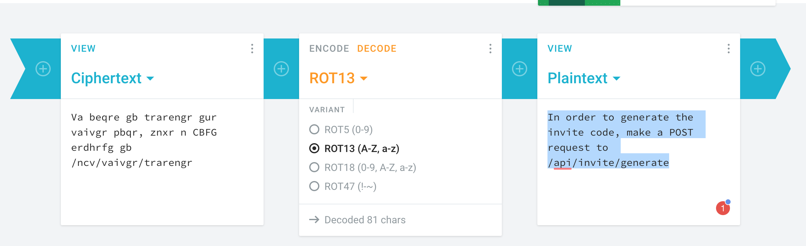
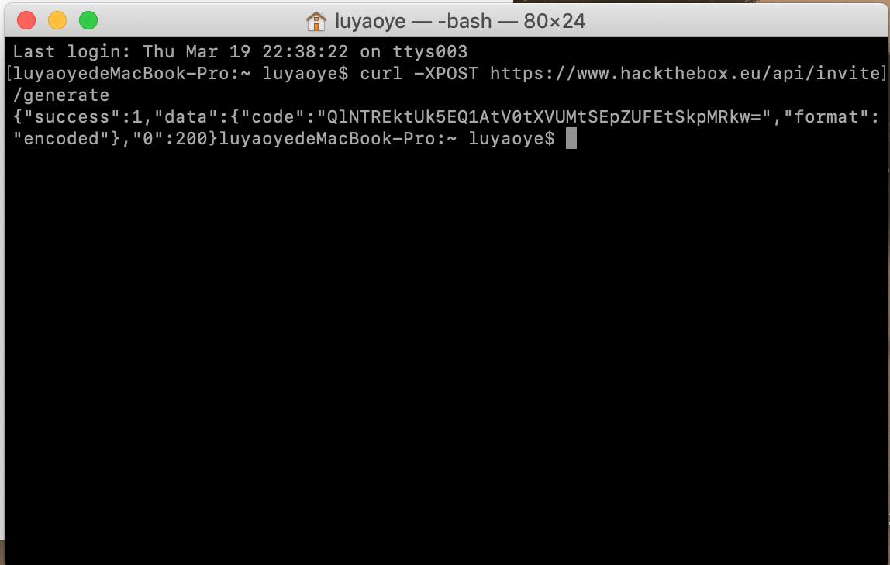
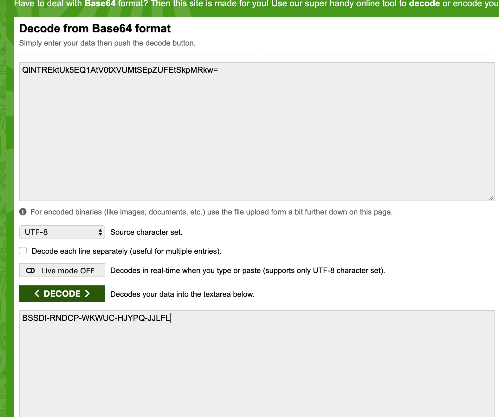
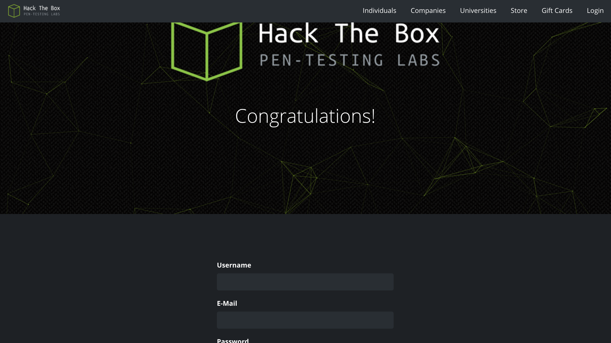

*A bit late for making this blog post, but I still think it is good to make this supplementary post about how to crack the HTB registration.*

# How to sign up in `Hack The Box` website:
The way to sign up in HTB is that you have to obtain an invite code and then you are free to go for registration.

So the way to get this invite code is involving a bit hacking, and it is quite fun.

## Steps:

1. Go to the Sign-Up page

2. Open the Chrome Dev Tools

3. Look at the elements of this page, go down a little bit and you will found a script with src to `/js/inviteapi.min.js`

4. We can also observe a src link of `https://www.hackthebox.eu/js/htb-frontend.min.js`, so we can try to replace the last part and go to the URL of `https://www.hackthebox.eu/js/inviteapi.min.js`. Then we will see a JS file like this.

5. We can see something interesting: `makeInviteCode`. So let's go back to console and type `makeInviteCode()` to find out.

6. Then we find something really interesting.

7.  If we click on the data, we can get a cipher:

"Va beqre gb trarengr gur vaivgr pbqr, znxr n CBFG erdhrfg gb /ncv/vaivgr/trarengr". And it is based on "ROT13".

8. Google a ROT13 online decoder, decode this cipher:

9. We can see the message " In order to generate the invite code, make a POST request to /api/invite/generate". So let's go to make POST request.

10. Open up a terminal and run the command below:

`curl -XPOST https://www.hackthebox.eu/api/invite/generate`

11. We get another encoded text: `QlNTREktUk5EQ1AtV0tXVUMtSEpZUFEtSkpMRkw=`

12. Now we can just try to decode it with base64.

13. Now we've got our invite code. We can go back to the sign-up page and sign up.

