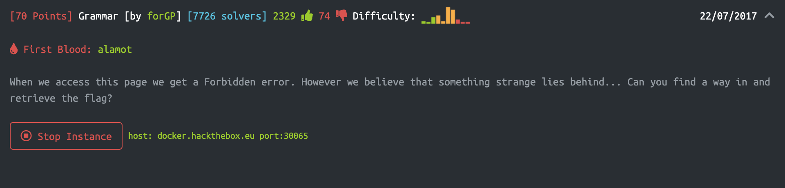
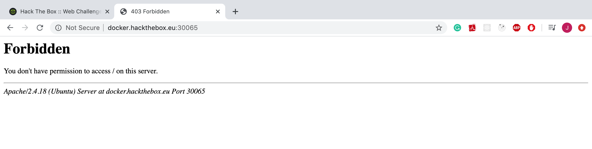
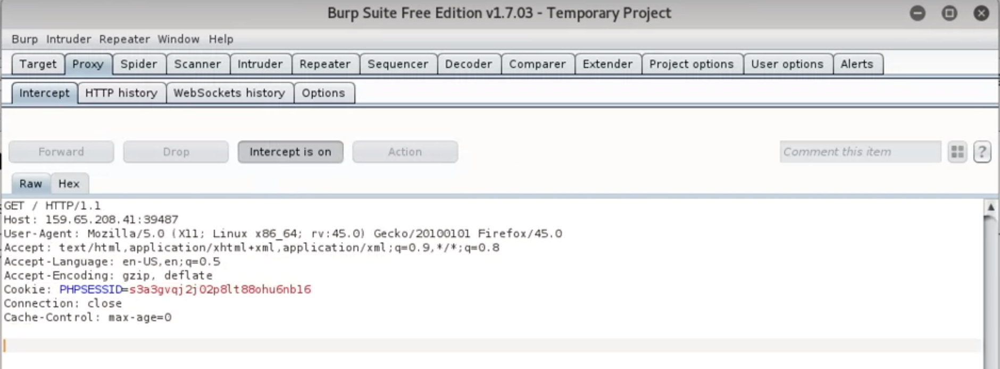
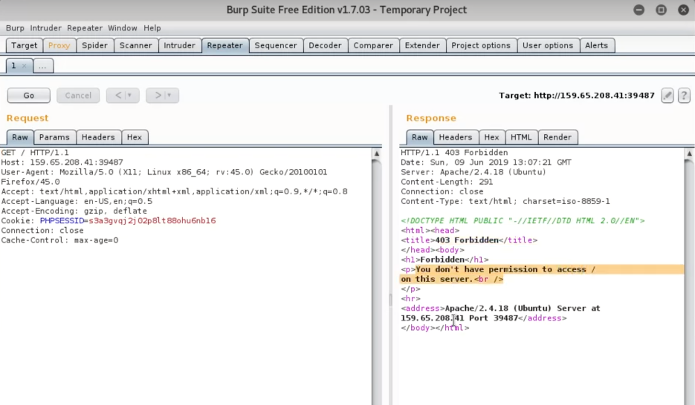
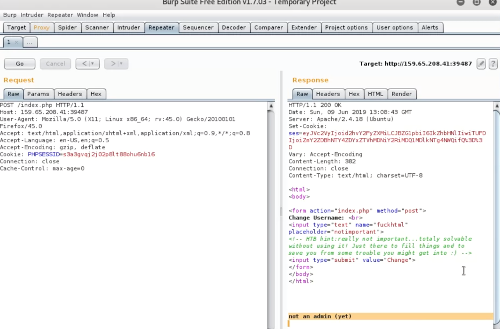
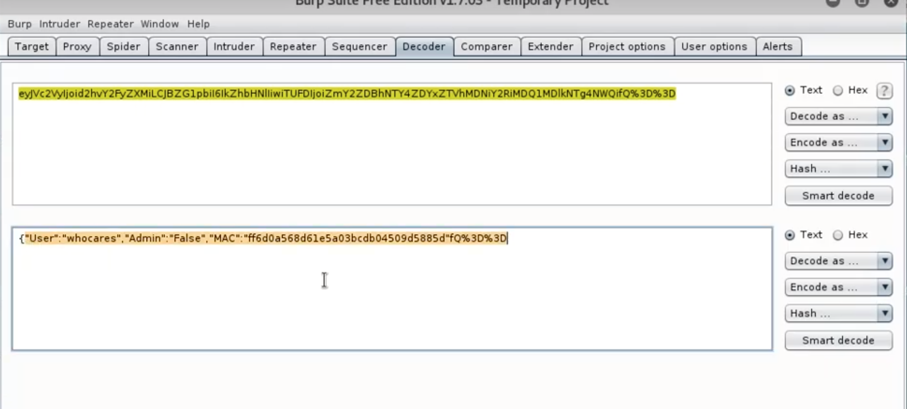
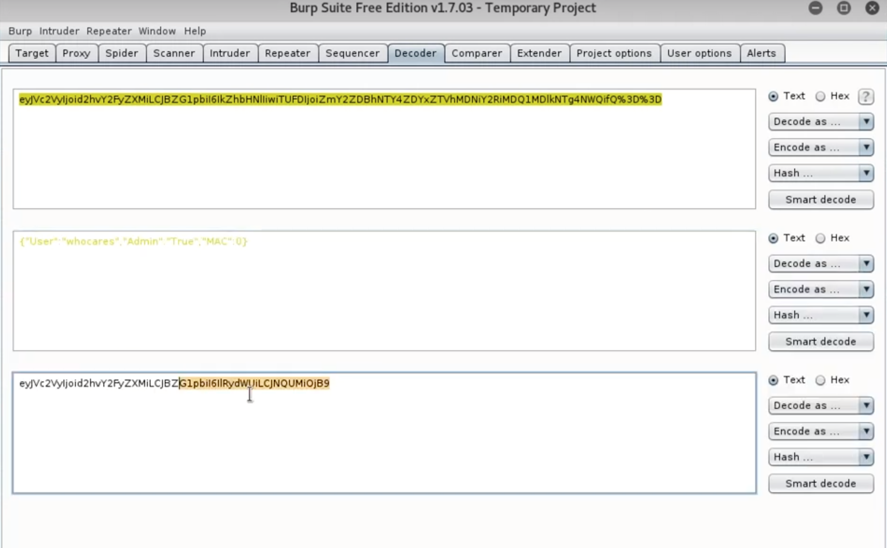
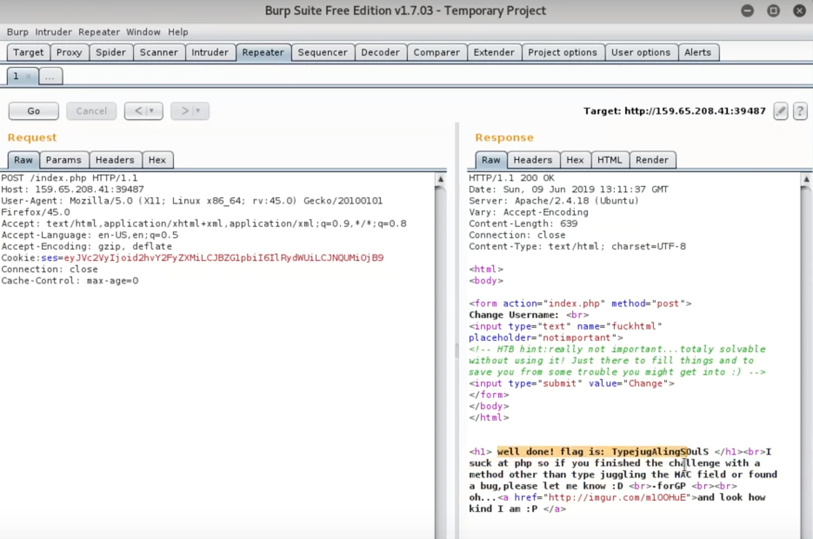
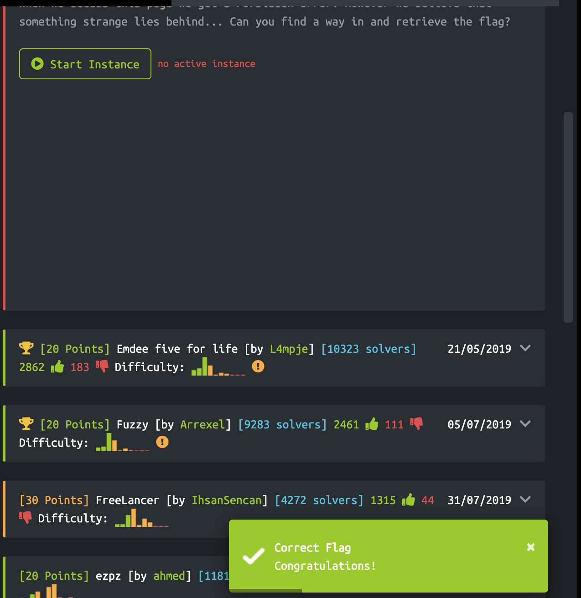

# Before Cracking:

Run the instance:

Go to instance:

# Trials

After going to the instance, I found I do not have permission by being prompted a forbidden error. So I went to inspect and walked around to see if I can find something.

Unluckily, nothing there. So I try to use Burp

Steps:

-   After Burp is up, refresh the `http://docker.hackthebox.eu:30065/`
    
-   Send to repeater, and got a response
    
-   Change `GET` request to `POST` request, and got a response
    
    > It seems like only the admin can get the flag
-   Notice that there is a token in the response, decode that as ASCII, I got:
    

-   Then I just tried to modify the decoded text and encoded it in Base64 to get a new token
    

-   After this, I went back to the request and replace the `PHPSESSID` with the new token to see what will happen.
    
    > Luckily, I got the flag

# Result

