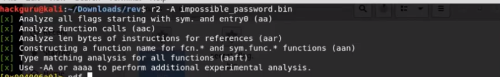
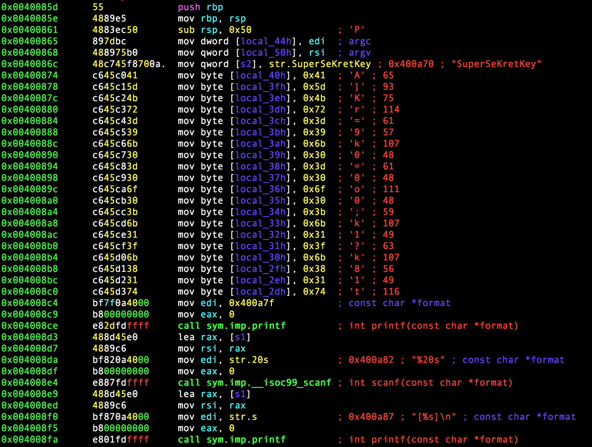

## Before cracking

download the zip file

## Cracking

What to do in this challenges is basically execute and input to bypass functions until reaching to the final one to obtain the flag.

-   get the binary file `impossible_password.bin`
-   open the binary file `r2 -A impossible_password.bin`
    > 
-   spring to the main function `pdf@main` to check out the asembly code
    > 
-   make the binary executable `chmod 755 impossible_password.bin` and run `./impossible_password.bin`

-   then input `SuperSekretKey` for further input

-   then input `dgdgfd` to obtain the flag

## Result

HTB{40b949f92b86b18}
